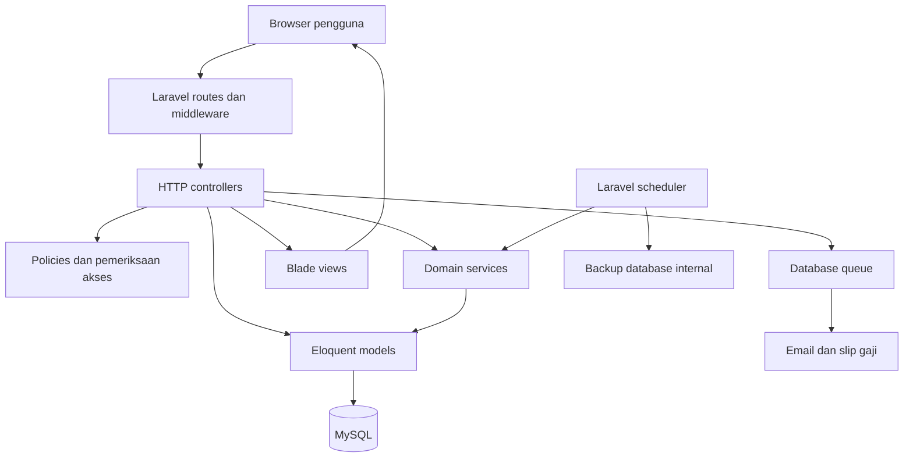
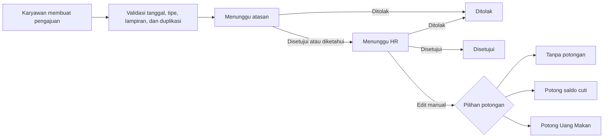

# HRD System

HRD System adalah aplikasi web internal untuk mengelola proses sumber daya manusia pada lingkungan perusahaan multi-PT. Aplikasi ini menggabungkan pengelolaan karyawan, absensi, izin dan cuti, lembur, pinjaman, slip gaji, inventaris operasional, serta aset perusahaan dalam satu sistem berbasis peran.

Repositori ini bersifat privat dan ditujukan untuk pengembangan, pemeliharaan, pengujian, dan deployment internal perusahaan. Kode, konfigurasi, data, dan dokumentasi di dalamnya tidak ditujukan untuk distribusi publik.

## Daftar Isi

- [Tujuan Sistem](#tujuan-sistem)
- [Modul Utama](#modul-utama)
- [Peran dan Hak Akses](#peran-dan-hak-akses)
- [Arsitektur Aplikasi](#arsitektur-aplikasi)
- [Alur Bisnis Utama](#alur-bisnis-utama)
- [Teknologi](#teknologi)
- [Struktur Direktori](#struktur-direktori)
- [Persyaratan Sistem](#persyaratan-sistem)
- [Instalasi Development](#instalasi-development)
- [Konfigurasi Environment](#konfigurasi-environment)
- [Menjalankan Aplikasi](#menjalankan-aplikasi)
- [Queue dan Scheduler](#queue-dan-scheduler)
- [Database](#database)
- [Testing dan Code Style](#testing-dan-code-style)
- [Deployment Internal](#deployment-internal)
- [Keamanan dan Perlindungan Data](#keamanan-dan-perlindungan-data)
- [Konvensi Pengembangan](#konvensi-pengembangan)
- [Pemecahan Masalah](#pemecahan-masalah)
- [Dokumentasi Tambahan](#dokumentasi-tambahan)
- [Lisensi dan Penggunaan](#lisensi-dan-penggunaan)

## Tujuan Sistem

HRD System dibangun untuk:

- Menyediakan satu sumber data operasional bagi HR, atasan, dan karyawan.
- Menstandarkan proses pengajuan dan persetujuan yang sebelumnya dilakukan secara terpisah.
- Menjaga histori perubahan saldo cuti melalui ledger transaksi.
- Memisahkan kewenangan pengguna berdasarkan peran, PT, dan divisi.
- Mendukung proses administrasi karyawan dari masa aktif sampai keluar dari perusahaan.
- Menyediakan jejak status dan persetujuan untuk pengajuan izin, cuti, lembur, pinjaman, ATK, OPS, dan ATK MKS.
- Mempermudah distribusi slip gaji, ekspor laporan, dan pengelolaan dokumen internal.

## Modul Utama

### Kepegawaian

- Profil dan data dasar karyawan.
- PT, divisi, jabatan, supervisor, dan status karyawan.
- Tanggal bergabung, masa kerja, masa percobaan, dan data keluar.
- Dokumen karyawan.
- Foto profil dan kompresi gambar terpusat.
- Shift kerja serta perubahan jadwal karyawan.

### Izin dan Cuti

- Pengajuan cuti tahunan, cuti khusus, sakit, izin, dinas luar, dan OFF SPV.
- Izin terlambat, pulang awal, dan meninggalkan pekerjaan di tengah jam kerja.
- Perhitungan hari efektif dengan mempertimbangkan hari kerja dan hari libur kantor.
- Persetujuan berjenjang oleh atasan dan HR.
- Pemeriksaan pengajuan yang bertabrakan atau terduplikasi.
- Penyesuaian tanggal pengajuan yang sudah disetujui.
- Edit HR dengan pilihan manual tanpa potongan, potong saldo cuti, atau potong Uang Makan.
- Histori saldo cuti melalui `leave_balance_transactions`.
- Kuota tahunan OFF SPV dan histori perubahannya.

### Absensi

- Clock in dan clock out untuk lokasi kerja.
- Absensi remote atau dinas luar.
- Validasi lokasi, radius, waktu, foto, dan status penyelesaian absensi.
- Approval dan pemantauan data absensi.
- Dashboard absensi karyawan.

### Lembur

- Pengajuan lembur karyawan.
- Persetujuan sesuai kewenangan pengguna.
- Filter berdasarkan tanggal dan status.
- Index gabungan untuk membantu pencarian berdasarkan pengguna, tanggal lembur, dan status.

### Pinjaman Karyawan

- Pengajuan pinjaman atau kasbon.
- Pembatasan kelayakan berdasarkan masa kerja.
- Persetujuan HR.
- Status pengajuan, pembatalan, cicilan, dan pelunasan.
- Snapshot informasi karyawan saat pengajuan dibuat.

### Payroll dan Slip Gaji

- Import data slip gaji dari Excel.
- Publikasi slip gaji kepada karyawan.
- Pembuatan dokumen PDF.
- Pengiriman email melalui queue.
- Pengaturan akses pengelolaan payroll.

### ATK

- Katalog barang dan keranjang permintaan.
- Pengajuan kebutuhan barang.
- Approval per item atau keseluruhan pengajuan.
- Master barang, stok, minimum stok, dan mutasi stok.
- Pengajuan manual oleh admin.
- Laporan dan ekspor data.

### OPS

- Modul kebutuhan operasional dengan alur yang menyerupai ATK.
- Akses pengguna berdasarkan divisi.
- Katalog, keranjang, permintaan, approval, stok, dan mutasi stok.
- Peran pengguna OPS dan Admin OPS.

### ATK MKS

- Varian modul ATK untuk kebutuhan Makassar.
- Akses reguler berdasarkan PT melalui `atk_mks_access_pts`.
- Akses administrator melalui peran Admin ATK MKS.
- Katalog, keranjang, permintaan, approval, stok, dan mutasi stok.

### Aset Perusahaan

- Kategori dan master aset.
- Penempatan aset kepada pengguna atau PT.
- Kondisi aset.
- Histori mutasi, serah terima, dan dokumen pendukung.

## Peran dan Hak Akses

Hak akses utama didefinisikan melalui `App\Enums\UserRole`.

| Peran | Tanggung jawab utama |
|---|---|
| `HRD` | Pengelolaan HR dan persetujuan akhir |
| `HR STAFF` | Administrasi HR sesuai batas kewenangan |
| `MANAGER` | Pengelolaan dan persetujuan dalam lingkup manajerial |
| `SUPERVISOR` | Mengetahui atau menyetujui pengajuan anggota tim |
| `EMPLOYEE` | Mengakses fitur mandiri karyawan |
| `ADMIN ATK` | Mengelola katalog, stok, permintaan, dan akses ATK |
| `OPS` | Mengakses modul kebutuhan operasional |
| `ADMIN OPS` | Mengelola modul dan akses OPS |
| `ADMIN ATK MKS` | Mengelola modul ATK MKS |

Beberapa pengguna dapat memiliki akses tambahan melalui `user_access_roles` tanpa mengubah peran utama pengguna. Akses tertentu juga dibatasi berdasarkan PT atau divisi.

Otorisasi diterapkan melalui kombinasi berikut:

- Middleware autentikasi.
- Middleware peran dan middleware khusus modul.
- `LeaveRequestPolicy` untuk pengajuan izin dan cuti.
- Helper akses pada model `User`.
- Pemeriksaan kepemilikan data pada controller.
- Relasi PT, divisi, supervisor, dan peran tambahan.

Perubahan route atau fitur baru tidak boleh melewati lapisan otorisasi yang sudah ada.

## Arsitektur Aplikasi

HRD System menggunakan arsitektur monolitik Laravel dengan tampilan server-rendered.



### Lapisan utama

1. **Routes dan middleware**
   Semua route web utama berada di `routes/web.php`. Route dikelompokkan berdasarkan autentikasi, peran, dan modul.

2. **Controller**
   Controller menerima request, menjalankan validasi dan otorisasi, memanggil service atau model, lalu mengembalikan Blade view atau response.

3. **Service**
   Logika bisnis yang sensitif dan digunakan lintas controller ditempatkan di `app/Services`.

4. **Model**
   Model Eloquent merepresentasikan tabel, relasi, query scope, accessor, dan helper domain.

5. **View**
   Antarmuka menggunakan Blade dan Tailwind CSS. Interaksi ringan ditulis dalam JavaScript pada Blade tanpa framework SPA.

6. **Queue dan scheduler**
   Pekerjaan email dan proses terjadwal dijalankan di luar request web utama.

### Domain service penting

| Service | Tanggung jawab |
|---|---|
| `LeaveBalanceService` | Mencatat dan menyesuaikan saldo cuti melalui ledger |
| `LeaveRequestStateMachine` | Menjaga transisi status pengajuan tetap valid |
| `LeaveRequestWorkflowService` | Menjalankan alur bisnis pengajuan dan approval |
| `LeaveRequestDuplicateCleanupService` | Menangani data pengajuan yang terduplikasi |
| `OffSpvQuotaService` | Mengelola periode dan kuota OFF SPV |
| `ImageCompressor` | Memproses dan mengompres upload gambar |

## Alur Bisnis Utama

### Pengajuan izin dan cuti

Jenis pengajuan didefinisikan oleh `App\Enums\LeaveType`:

- `IZIN_TELAT`
- `IZIN_PULANG_AWAL`
- `IZIN_TENGAH_KERJA`
- `CUTI`
- `SAKIT`
- `IZIN`
- `CUTI_KHUSUS`
- `DINAS_LUAR`
- `OFF_SPV`

Alur umum:



Status aktual dapat berbeda berdasarkan peran pemohon dan aturan jenis pengajuan. Semua perubahan status harus mengikuti state machine dan policy yang berlaku.

### Saldo cuti

- Saldo cuti tidak boleh diubah langsung dari controller.
- Semua perubahan dicatat melalui `LeaveBalanceService` ke ledger `leave_balance_transactions`.
- Penyesuaian ulang harus merekonsiliasi transaksi yang sudah ada agar tidak terjadi potongan ganda.
- Hak cuti pertama diberikan berdasarkan masa kerja dan kebijakan prorata.
- Reset tahunan diproses oleh scheduler sesuai aturan bisnis.

### Potong Uang Makan

Pilihan Potong Uang Makan pada pengajuan menyimpan keputusan HR pada data pengajuan. Implementasi tersebut tidak secara otomatis memotong nominal payroll; integrasi finansial harus diperlakukan sebagai proses terpisah apabila dikembangkan di kemudian hari.

### ATK, OPS, dan ATK MKS

Ketiga modul menggunakan pola katalog, keranjang, pengajuan, review admin, finalisasi, stok, dan mutasi stok. Walaupun strukturnya paralel, aturan aksesnya berbeda:

- ATK menggunakan akses pengguna dan Admin ATK.
- OPS menggunakan akses berbasis divisi dan Admin OPS.
- ATK MKS menggunakan akses berbasis PT dan Admin ATK MKS.

Perubahan pada salah satu modul harus diperiksa dampaknya terhadap dua modul paralel lainnya.

## Teknologi

| Lapisan | Teknologi |
|---|---|
| Backend | PHP `^8.2`, Laravel `^12.0` |
| Frontend | Blade, Tailwind CSS 4, Vite 7, axios |
| Database produksi | MySQL atau MariaDB yang kompatibel |
| Database testing | SQLite sekali pakai |
| Queue | Database queue pada environment pengembangan/produksi |
| Session | Database session pada konfigurasi default |
| Cache | Database cache pada konfigurasi default |
| Testing | Pest 3 dan PHPUnit |
| PDF | `barryvdh/laravel-dompdf` |
| Excel | `maatwebsite/excel` |
| Gambar | `intervention/image` |
| Analisis skema | `doctrine/dbal` |
| Code style | Laravel Pint |

Versi yang terpasang secara tepat mengikuti `composer.lock` dan `package-lock.json`.

## Struktur Direktori

```text
app/
├── Console/Commands/       Command aplikasi
├── Enums/                  Enum peran dan tipe domain
├── Exports/                Export Excel
├── Helpers/                Helper umum aplikasi
├── Http/Controllers/       Controller web per modul
├── Http/Middleware/        Middleware autentikasi dan akses
├── Imports/                Import Excel
├── Jobs/                   Queue jobs
├── Mail/                   Template dan class email
├── Models/                 Eloquent models
├── Policies/               Kebijakan otorisasi
└── Services/               Logika bisnis lintas controller

bootstrap/                  Bootstrap aplikasi dan registrasi middleware
config/                     Konfigurasi Laravel dan paket
database/
├── factories/              Factory data testing
├── migrations/             Definisi sumber skema
├── seeders/                Seeder data awal atau import
├── sql/                    Artefak SQL manual
└── deployment/             Artefak deployment database bila tersedia

public/                     Entry point web, aset publik, PWA, dan hasil build
resources/
├── css/                    Stylesheet sumber
├── js/                     JavaScript sumber
└── views/                  Blade views per modul

routes/
├── web.php                 Route web aplikasi
└── console.php             Command closure dan scheduler

storage/                    Log, cache, file aplikasi, dan backup lokal
tests/
├── Feature/                Pengujian alur aplikasi
├── Unit/                   Pengujian unit
└── Support/                Helper skema dan data test
```

## Persyaratan Sistem

Pastikan environment menyediakan:

- PHP 8.2 atau lebih baru.
- Composer 2.
- Node.js dan npm yang kompatibel dengan Vite 7.
- MySQL atau MariaDB.
- Ekstensi PHP yang dibutuhkan Laravel dan paket Composer.
- Web server seperti Nginx, Apache, atau server development Laravel.
- Worker queue untuk proses email pada environment yang menggunakannya.
- Scheduler sistem untuk menjalankan jadwal Laravel.

Untuk Windows, proyek dapat dijalankan melalui Laragon selama versi PHP, database, Composer, dan Node.js memenuhi kebutuhan proyek.

## Instalasi Development

### 1. Ambil source code

```bash
git clone <alamat-repositori-internal>
cd hrd-system
```

### 2. Instal dependency PHP

```bash
composer install
```

### 3. Siapkan file environment

Windows PowerShell:

```powershell
Copy-Item .env.example .env
```

Linux atau macOS:

```bash
cp .env.example .env
```

Kemudian buat application key:

```bash
php artisan key:generate
```

### 4. Konfigurasikan database

Atur koneksi database pada `.env` sesuai environment lokal. Jangan menggunakan kredensial produksi untuk development.

Skema database disediakan melalui proses manual terpisah yang dikelola pemilik repositori. Jangan menggunakan script setup otomatis karena script tersebut memiliki langkah yang menyentuh skema database.

### 5. Instal dependency frontend

```bash
npm install
```

### 6. Build aset frontend

```bash
npm run build
```

## Konfigurasi Environment

Gunakan `.env.example` sebagai referensi. Nilai berikut harus diperiksa pada setiap environment:

```dotenv
APP_NAME="HRD System"
APP_ENV=local
APP_DEBUG=true
APP_URL=http://localhost

DB_CONNECTION=mysql
DB_HOST=127.0.0.1
DB_PORT=3306
DB_DATABASE=hrd_system
DB_USERNAME=root
DB_PASSWORD=

SESSION_DRIVER=database
QUEUE_CONNECTION=database
CACHE_STORE=database

MAIL_MAILER=log
MAIL_FROM_ADDRESS="hr@example.internal"
MAIL_FROM_NAME="${APP_NAME}"
```

Catatan:

- Jangan menyalin nilai kredensial dari environment produksi ke dokumentasi.
- `APP_DEBUG` harus dinonaktifkan pada produksi.
- `APP_URL` harus sesuai domain aplikasi.
- Konfigurasi mail harus disesuaikan sebelum distribusi slip gaji melalui email.
- Driver database untuk session, queue, dan cache membutuhkan tabel pendukung yang tersedia pada skema environment.
- File `.env` tidak boleh dimasukkan ke Git.

## Menjalankan Aplikasi

### Menjalankan seluruh proses development

```bash
composer run dev
```

Script tersebut menjalankan server Laravel, queue listener, dan Vite secara bersamaan.

### Menjalankan proses secara terpisah

Terminal web server:

```bash
php artisan serve
```

Terminal frontend:

```bash
npm run dev
```

Terminal queue:

```bash
php artisan queue:listen --tries=1
```

Untuk build aset produksi:

```bash
npm run build
```

## Queue dan Scheduler

### Queue

Queue digunakan untuk pekerjaan yang tidak harus selesai dalam request web, terutama pengiriman email slip gaji.

Worker development dapat dijalankan dengan:

```bash
php artisan queue:listen --tries=1
```

Pada produksi, worker sebaiknya dikelola oleh process supervisor sesuai standar infrastruktur perusahaan.

### Scheduler

Scheduler menggunakan zona waktu `Asia/Jakarta` dan menjalankan:

| Jadwal | Proses |
|---|---|
| Setiap hari 00:01 | Pemeriksaan anniversary dan pembaruan saldo cuti |
| Setiap 1 Januari 00:05 | Inisialisasi periode OFF SPV tahunan |
| Setiap hari 23:59 | Backup database internal ke file terbaru |

Server produksi harus menjalankan scheduler Laravel melalui mekanisme scheduler sistem yang dikelola administrator server.

Proses backup menggunakan utilitas dump database dan konfigurasi koneksi aktif. Perubahan pada command backup harus ditinjau dari sisi keamanan karena command tersebut membentuk perintah sistem.

## Database

### Prinsip pengelolaan

- Database produksi menggunakan MySQL atau MariaDB.
- SQLite hanya digunakan untuk test otomatis.
- Saldo cuti dikelola melalui ledger, bukan pembaruan kolom langsung.
- Foreign key dan index harus dipertahankan saat menyiapkan skema server.
- Isi `.env` dan kredensial database tidak boleh dicatat di commit, issue, atau dokumentasi.

### Aturan perubahan skema

Perubahan skema database mengikuti proses manual terpisah milik pemilik repositori:

1. Developer menyiapkan file sumber perubahan skema atau artefak SQL yang diperlukan.
2. Perubahan ditinjau terhadap source code dan database target.
3. Backup diverifikasi sebelum proses penerapan.
4. Pemilik repositori menerapkan perubahan melalui prosedur internal.
5. Struktur database diverifikasi kembali tanpa membandingkan atau mengubah isi data bila pemeriksaan hanya ditujukan pada skema.

Agent, script setup, dan proses otomatis repositori tidak diizinkan menerapkan, menghapus, me-reset, me-rollback, atau memeriksa skema melalui command Artisan database. Baca `STRICT-RULES.md` sebelum menjalankan atau merekomendasikan command apa pun.

The schema change file is prepared. Applying database changes is intentionally not performed and remains part of the repository owner's separate manual process.

### Artefak database

Artefak perubahan skema dapat berada di:

- `database/migrations/`
- `database/sql/`
- `database/deployment/`
- `version/sql-updates/`

Keberadaan file tersebut tidak berarti perubahan sudah diterapkan ke database mana pun.

## Testing dan Code Style

### Menjalankan test

Seluruh test:

```bash
php artisan test
```

Alternatif menggunakan Pest:

```bash
vendor/bin/pest
```

Menjalankan test tertentu:

```bash
php artisan test --filter=NamaTest
```

### Keamanan database test

- `phpunit.xml` menetapkan koneksi SQLite.
- `tests/TestCase.php` membuat file SQLite sekali pakai untuk setiap class test.
- Database MySQL aktif tidak digunakan oleh test.
- Feature test menggunakan transaction agar perubahan data test dibatalkan.
- Jangan mengganti trait database test dengan trait yang membangun ulang skema secara otomatis.

### Code style

Periksa format tanpa mengubah file:

```bash
vendor/bin/pint --test
```

Perbaiki format:

```bash
vendor/bin/pint
```

Sebelum perubahan diserahkan, jalankan test yang relevan dan pemeriksaan format sesuai ruang lingkup perubahan.

## Deployment Internal

Deployment harus mengikuti prosedur internal perusahaan dan dilakukan oleh personel yang memiliki otorisasi server.

### Kelompok file aplikasi

| Folder atau file | Kapan perlu dikirim |
|---|---|
| `app/` | Saat controller, model, service, job, middleware, policy, enum, atau helper berubah |
| `resources/` | Saat Blade, CSS sumber, atau JavaScript sumber berubah |
| `routes/` | Saat route web atau scheduler berubah |
| `config/` | Saat konfigurasi Laravel atau paket berubah |
| `public/` | Saat aset publik atau hasil build berubah |
| `composer.json` dan `composer.lock` | Saat dependency PHP berubah |
| `package.json` dan `package-lock.json` | Saat dependency frontend berubah |
| `database/` atau `version/` | Hanya sebagai artefak perubahan skema untuk proses manual terpisah |

Folder `tests/` tidak diperlukan untuk deployment manual biasa, tetapi tetap harus disimpan di repositori dan dijalankan pada proses validasi.

### Checklist deployment

1. Pastikan branch dan commit yang akan dikirim sudah benar.
2. Periksa daftar file berubah dan pisahkan file aplikasi dari file test atau dokumentasi.
3. Jalankan test yang relevan.
4. Build aset frontend jika sumber CSS atau JavaScript berubah.
5. Backup file aplikasi dan database sesuai prosedur internal.
6. Unggah hanya file yang berubah atau gunakan mekanisme deployment Git perusahaan.
7. Instal dependency produksi bila lock file berubah.
8. Pastikan permission `storage/` dan `bootstrap/cache/` tetap benar.
9. Pastikan queue worker menggunakan source code terbaru.
10. Verifikasi login, otorisasi, halaman yang diubah, queue, dan scheduler setelah deployment.

### Deployment database

Deployment source code tidak otomatis memberikan izin untuk mengubah skema atau data database. Artefak skema diserahkan terpisah dan penerapannya dilakukan secara manual oleh pemilik repositori sesuai prosedur perusahaan.

## Keamanan dan Perlindungan Data

Repositori dan aplikasi memproses informasi internal dan data karyawan. Terapkan aturan berikut:

- Jangan commit `.env`, password, token, cookie, kredensial database, atau konfigurasi mail produksi.
- Jangan menyalin data karyawan asli ke issue, pull request, screenshot, atau test fixture.
- Gunakan factory dan data sintetis untuk test.
- Jangan melewati middleware atau policy untuk mempercepat implementasi.
- Validasi setiap upload dan proses gambar melalui service yang ditentukan.
- Batasi akses file dokumen dan slip gaji berdasarkan kepemilikan serta peran.
- Jangan menampilkan stack trace atau debug information pada produksi.
- Tinjau query dan export agar tidak membocorkan data lintas PT atau divisi.
- Jangan menjalankan command sistem yang membentuk input dari pengguna tanpa validasi.
- Tinjau perubahan pada proses backup karena melibatkan kredensial dan command sistem.

Jika ditemukan potensi kebocoran data atau bypass otorisasi, hentikan deployment dan laporkan melalui jalur internal perusahaan.

## Konvensi Pengembangan

- Gunakan Bahasa Indonesia untuk label UI, pesan validasi, dan komentar domain yang baru.
- Ikuti pola controller, model, route, dan Blade yang sudah ada.
- Jangan mengganti nama class lama tanpa kebutuhan yang jelas.
- Gunakan enum untuk nilai domain yang sudah memiliki enum.
- Letakkan logika bisnis lintas controller pada service.
- Gunakan `LeaveBalanceService` untuk perubahan saldo cuti.
- Gunakan `ImageCompressor` untuk upload gambar karyawan.
- Pertahankan pemisahan akses berdasarkan peran, PT, dan divisi.
- Periksa modul ATK, OPS, dan ATK MKS ketika mengubah pola yang digunakan bersama.
- Hindari refactor di luar ruang lingkup perubahan.
- Tambahkan atau perbarui test untuk perubahan perilaku.
- Pertahankan kompatibilitas tampilan mobile dan desktop.

## Pemecahan Masalah

### Aset frontend tidak diperbarui

1. Pastikan dependency npm sudah terpasang.
2. Jalankan build frontend kembali.
3. Periksa apakah hasil build terbaru telah dikirim ke server.
4. Periksa cache browser dan service worker PWA.

### Email tidak terkirim

1. Periksa konfigurasi mail tanpa menampilkan kredensial.
2. Pastikan queue worker berjalan.
3. Periksa tabel queue dan log aplikasi.
4. Pastikan job tidak terus gagal dan masuk ke daftar failed jobs.

### Halaman menampilkan akses ditolak

1. Periksa peran utama pengguna.
2. Periksa `user_access_roles` bila fitur menggunakan peran tambahan.
3. Periksa PT atau divisi pengguna untuk modul yang membatasi akses berdasarkan organisasi.
4. Periksa middleware dan policy route terkait.

### Saldo cuti tidak sesuai

1. Periksa histori `leave_balance_transactions`.
2. Periksa status dan tipe pengajuan terkait.
3. Pastikan tidak ada potongan langsung di luar `LeaveBalanceService`.
4. Periksa apakah pengajuan pernah diedit atau direkonsiliasi oleh HR.

### Test mencoba menggunakan database yang salah

1. Pastikan konfigurasi `phpunit.xml` tidak diubah.
2. Pastikan environment test menggunakan SQLite.
3. Hapus cache konfigurasi development melalui prosedur yang aman sebelum menjalankan test kembali.
4. Jangan mengarahkan test ke database MySQL lokal atau produksi.

## Dokumentasi Tambahan

- [`AGENTS.md`](AGENTS.md): konteks proyek dan instruksi untuk coding agent.
- [`STRICT-RULES.md`](STRICT-RULES.md): aturan wajib penggunaan database dan command.
- [`PROJECT_AUDIT_AND_DOCUMENTATION.md`](PROJECT_AUDIT_AND_DOCUMENTATION.md): dokumentasi teknis dan audit proyek.
- [`ATTENDANCE-UPDATES-2026.MD`](ATTENDANCE-UPDATES-2026.MD): catatan perubahan modul absensi.
- [`KIMI.md`](KIMI.md): entry point instruksi untuk agent Kimi.

Jika dokumentasi dan source code berbeda, source code serta aturan wajib terbaru menjadi sumber kebenaran utama.

## Lisensi dan Penggunaan

HRD System hanya untuk penggunaan internal perusahaan. Dilarang menyalin, mendistribusikan, mempublikasikan, menjual, atau menggunakan source code dan data di luar kepentingan perusahaan tanpa persetujuan tertulis dari pemilik repositori.

Informasi hak cipta, kepemilikan, dan ketentuan penggunaan formal mengikuti kebijakan internal perusahaan.
